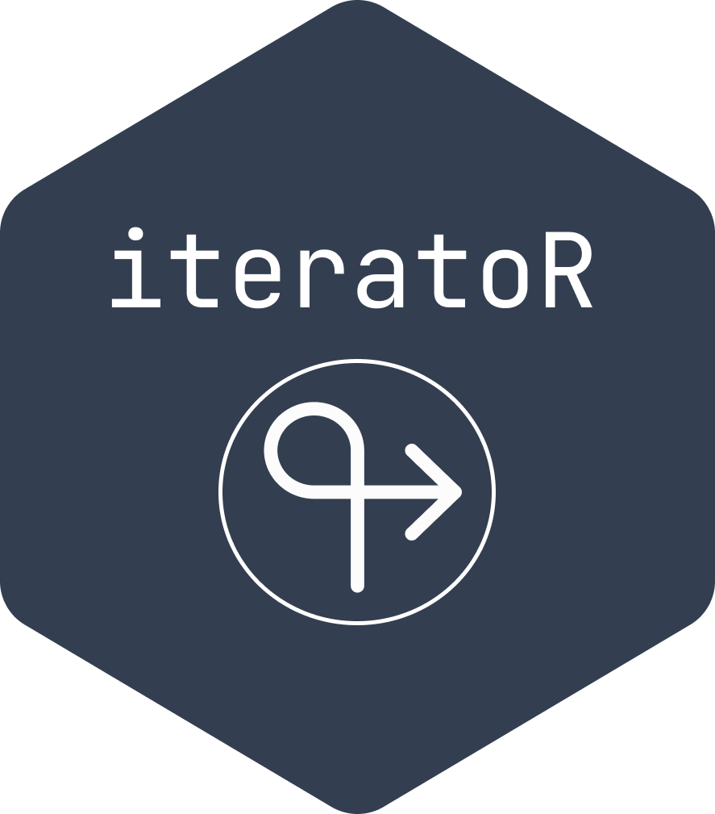
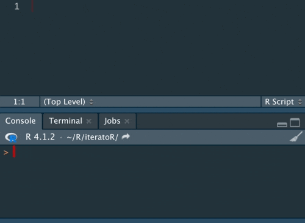

# iteratoR <a href='https://github.com/stevecondylios/iteratoR'></a>


Place `iteration()` inside a loop and it will print the loop iteration to the console at useful intervals. Here's a demonstration





# Example

This loop provides no feedback about where it is up to:

```r
for(i in 1:100000) {
  2 * 2
}
```

Place `iteration()` inside the loop to print the loop iteration at intervals of 10, 20, 50, 100, 200, 500, 1000, 2000, 5000, etc: 

```r
for(i in 1:100000) {
  2 * 2
  iteration()
}
# 10
# 20
# 50
# 100
# 200
# 500
# 1,000
# 2,000
# 5,000
# 10,000
# 20,000
# 50,000
# 100,000
```


# Installation

Install from GitHub with `devtools::install_github("stevecondylios/iteratoR")`. Example:

```r
devtools::install_github("stevecondylios/iteratoR")

library(iteratoR)

for(i in 1:100000) {
  2 * 2
  iteration()
}
```


# Extras

When the iterator is something other than 'i' (example: 'page'):

```r

for(page in 1:100000) {
  2 * 2
  iteration("page")
}

```

Use custom iteration intervals:

```r

for(i in 1:100000) {
  2 * 2
  iteration(iteration_values = seq(0, 1e5, 1e4))
}

```


# Performance

`iteration()` may be great for slow or medium paced loops, but may add considerably to the execution time of extremely fast loops, so use with care:

```r
# Performing 2 * 2 a billion times takes ~10 seconds without iteration()
for(i in 1:1000000000) {
  2 * 2
}


# This very fast loop cycle would be slowed down considerably if iteration() 
# was used. That is, it adds 0.3 of a millisecond per iteration; about 4 seconds 
# per 100,000 iterations
start_time <- Sys.time()
for(i in 1:100000) {
  2 * 2
  iteration()
}
end_time <- Sys.time()
end_time - start_time
```
